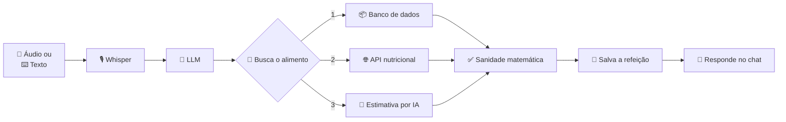

<div align="center">

# 🍽️ Anotai

### **Seu diário alimentar inteligente, direto no Telegram.**

> **Envie um áudio ou uma mensagem. A IA identifica os alimentos, calcula os macronutrientes e registra tudo automaticamente.**

<br>


<br><br>

[](https://php.net)
[](https://laravel.com)
[](https://supabase.com)
[](https://core.telegram.org/bots/api)
[](https://groq.com)
[](https://www.chartjs.org)

<br>

### 🎤 Converse • 🍽️ Registre • 📊 Acompanhe

</div>

---

## ✨ Visão Geral

**Anotai** transforma o registro da alimentação em uma conversa.

Esqueça aplicativos cheios de formulários e buscas intermináveis por alimentos.

Basta enviar um **áudio** ou **mensagem** para o bot do Telegram e toda a inteligência acontece automaticamente.

```text
"Hoje no almoço comi arroz, feijão, 150g de frango e uma banana."

↓

🧠 IA interpreta
🔎 Identifica os alimentos
📊 Calcula proteína, carboidrato, gordura e calorias
💾 Salva a refeição
📱 Retorna o resumo em segundos
```

Tudo em português, direto na conversa do Telegram — sem cadastro, sem senha, sem fricção.

---

## 🚀 Principais Recursos

<table>
<tr>
<td width="50%">

### 🎤 Entrada Inteligente
- Áudio ou texto
- Transcrição automática
- Linguagem natural
- Português nativo

</td>
<td width="50%">

### 🧠 IA Nutricional
- Reconhecimento automático
- Pratos compostos tratados como um item só
- IA usada apenas como último recurso
- Verificação matemática contra alucinação

</td>
</tr>
<tr>
<td>

### 📊 Acompanhamento
- Proteínas, carboidratos, gorduras e calorias
- Metas diárias e semanais
- Aviso quando um macro passa da meta

</td>
<td>

### 📈 Dashboard Mobile
- Feito pra abrir do celular
- Gráficos dos últimos 7 dias
- Histórico com edição manual

</td>
</tr>
</table>

---

## ⚡ Como Funciona



---

## 🧠 IA como último recurso, não como atalho

O maior risco de qualquer app nutricional com IA é a **alucinação** — o modelo "inventar" um valor que soa plausível mas está errado. O Anotai foi desenhado de propósito pra minimizar isso:

```text
1️⃣ Banco de dados nutricional
        ↓  (só se não encontrar)
2️⃣ API nutricional externa
        ↓  (só se a API também não encontrar)
3️⃣ Estimativa por IA
```

- A IA **só é chamada quando as duas fontes anteriores falham** — não é o caminho padrão, é o último degrau
- Toda estimativa (de API ou de IA) passa por uma **checagem de sanidade matemática**: as calorias informadas são comparadas com o cálculo real a partir dos macronutrientes (proteína, carboidrato e gordura); se a diferença for grande demais, o sistema recalcula em vez de confiar cegamente na fonte
- **Pratos compostos** ("arroz com feijão e um bife") são reconhecidos como uma única refeição — evita contar os mesmos ingredientes em dobro
- Diferentes formas de dizer a mesma quantidade (fatia, colher, porção, unidade, grama) são convertidas corretamente antes do cálculo
- O que é aprendido nas etapas 2 e 3 passa a integrar a base — o sistema fica mais rápido e mais preciso a cada uso

---

## 📊 O que o usuário recebe

Formato real da resposta, enviada segundos depois do áudio ou texto:

```text
🍽️ Resumo da Refeição

• Arroz — 100 g · 130 kcal
• Feijão — 100 g · 76 kcal
• Peito De Frango — 150 g · 248 kcal
• Banana — 1 un · 97 kcal

───────────────────
🔥 Total: 551 kcal
🥩 Proteína: 55.3g
🍞 Carbo: 67.8g
🥑 Gordura: 6.6g
```

Também recebe:
- 📅 Resumo do dia e da semana, com barra de progresso por macro quando há meta definida
- 🎯 Aviso quando algum macro ultrapassa a meta diária
- 🗑️ Comando para desfazer a última refeição registrada

---

## 📱 Dashboard

Painel web pensado **100% para uso no celular** — o link chega direto na conversa do Telegram, sem precisar instalar nada.

- 🎨 Design moderno e enxuto, sem "cara de painel administrativo"
- 📈 Carrossel de gráficos com a evolução dos últimos 7 dias
- 📋 Histórico completo de refeições, com edição manual quando precisar corrigir algo
- 🎯 Progresso de metas com barra visual por macro
- ⚡ Leve: sem framework de frontend pesado, carrega rápido mesmo em conexão ruim

---

## 🔐 Autenticação & Segurança

Não existe cadastro, login ou senha — o Telegram já autentica quem está falando com o bot.

- 🔑 **Dashboard sem senha**: acessado por um link assinado, gerado e enviado pelo próprio bot pelo comando `/app` — expira sozinho
- 👤 **Isolamento por usuário**: cada pessoa só enxerga as próprias refeições e metas, vinculadas ao seu chat do Telegram
- 🔒 **Webhook protegido**: toda mensagem passa por validação de token secreto antes de qualquer processamento; sem o token configurado, o endpoint recusa tudo por padrão
- 🚦 **Proteção contra abuso**: limite de requisições no endpoint público, evitando uso indevido da IA
- 🗄️ **Dados privados**: nenhuma informação de refeição ou meta é compartilhada com terceiros

---

## 🏗️ Arquitetura / Stack

| Camada | Tecnologia |
|---|---|
| 🖥️ Backend | PHP 8.3+ · Laravel 13 |
| 🗄️ Banco de dados | PostgreSQL (Supabase) |
| 🤖 Bot | Telegram Bot API |
| 🧠 IA / NLP | Groq (Whisper + LLaMA) |
| 🎨 Dashboard | Blade · CSS próprio · Chart.js |
| ☁️ Hospedagem | Render + Supabase |
| 🧪 Testes | PHPUnit |

**Fluxo stateless**: todo o backend é orquestrado por um único endpoint de webhook — sem sessões de conversa, sem estado guardado em memória entre mensagens. Cada requisição é independente e idempotente.

---

## 🎯 Diferenciais

- ✅ Registro por áudio e texto, em linguagem natural
- ✅ IA usada só como último recurso — nunca é a fonte "padrão" de dados
- ✅ Checagem matemática contra alucinação em toda estimativa de IA
- ✅ Reconhece pratos compostos sem duplicar macros
- ✅ Entende porção, fatia, colher, unidade e grama corretamente
- ✅ Busca o alimento mais específico disponível, não o mais genérico
- ✅ Dashboard mobile-first com gráficos e edição manual
- ✅ Autenticação sem senha, isolada por usuário
- ✅ Webhook protegido, com proteção contra abuso
- ✅ Pipeline totalmente stateless e idempotente

---

## 🚀 Rodando localmente

### 1) Clone o projeto

```bash
git clone https://github.com/brunoverly/anotai.git
cd anotai
```

### 2) Instale as dependências

```bash
composer install
```

### 3) Configure o ambiente

```bash
cp .env.example .env
php artisan key:generate
```

Configure no `.env`:

```env
TELEGRAM_BOT_TOKEN=
TELEGRAM_WEBHOOK_SECRET=
GROQ_API_KEY=
```

### 4) Banco de dados

```bash
php artisan migrate --seed
```

### 5) Inicie o projeto

```bash
composer dev
```

`composer dev` sobe o servidor PHP, o worker de fila e o Vite simultaneamente. O bot é acessado inteiramente via webhook.

---

## 🧪 Testes

```bash
composer test
```

---

## 💡 Filosofia

> **Registrar a alimentação deve ser tão simples quanto enviar uma mensagem para um amigo.**

---

<div align="center">

## 🍚 Feito com Laravel, IA e muito café.

### Se este projeto foi útil para você, considere deixar uma ⭐ no repositório.

<br>

<a href="https://github.com/brunoverly">
  
</a>

</div>
